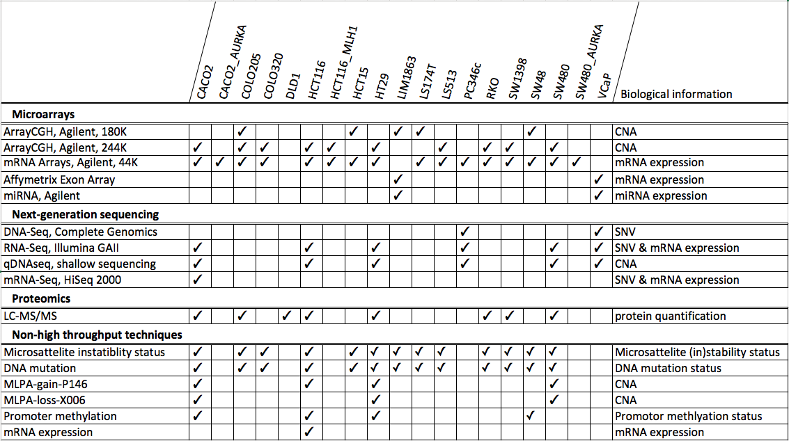

# How to load the TraIT Cell line use case 

The CTMM TraIT project recently added the Cell Line Use Case (CLUC) to tranSMART. The CLUC is a collection of data on colorectal and prostate cell lines from an exceptionally broad set of platforms, as shown in the table below.
This diverse set is used to:
 - Standardize data formats and data processing pipelines from the four domain
 - Test the integration pipelines within the TraIT translational toolset

By incorporating the same platforms as used for ongoing research projects, this cell line set gives a representative test set comparable to real patient data, without the legal burden of handling personal data. The TraIT Cell Line Use Case is available under the CC0 license for [download here](https://wiki.transmartfoundation.org/display/transmartwiki/Tutorial%3A+How+to+load+the+Cell+Line+Use+Case+dataset+with+transmart-data).

Please use the following citation when making use of this dataset: Mariska Bierkens & Jochem Bijlard *"The TraIT cell line use case."* Manuscript in preparation. More information can also be found on the **Bio-IT World** Poster *"Multi-omics data analysis in tranSMART using the Cell Line Use Case dataset"*.

# Molecular profiling data present in this dataset:


##### Make sure to setup transmart-batch
During the setup you should configure whether you want to load the data to a local transmart or over ssh to a remote one. Follow the instructions on how to do this [here.](../README.md)

# What's in the box?
This is the directory structure of the downloaded dataset. A similar structure is recommended as transmart-batch functions optimally when a params file is given as a argument when that file is a subdirectory of a file called `study.params`.  We will go over some key concepts below.

```
TraIT-Cell-lines
│   study.params
├── acgh
    ├── genes
    |   ├── 180k
    |   |   |   cnv.params
    |   |   |   Cell-line_samples.txt
    |   |   |   Cell-line_subjectmapping.txt
    |   ├── 244k
    |   └── annotation
    |   |   |   cnv_annotation.params
    |   |   |   GPL8687-gene_platform.txt
    ├── qdnaseq
    └── regions
├── clinical
    |   clinical.params
    |   Cell-line_columns.txt
    |   Cell-line_wordmap.txt
    |   Cell-line_NHTMP.txt
├── tags
    |   tags.params
    |   tags.txt
├── expression
├── mirna
├── proteomics
└── rnaseq
```

## Key features
Below I will shortly highlight four classes of parameter files you can find in the CLUC.  I will not go into too much details and if you want to know more you can follow the provided links.

#### study.params

* `STUDY_ID` = **TRAIT-CELL-LINE**
* `SECURITY_REQUIRED` = **N**
* `TOP_NODE` = **\Public Studies\TraIT-Cell-line**

For more info and additional options see [docs](data_formats/study-params.md).

#### clinical.params
* `COLUMN_MAP_FILE` = **Cell-line_columns.txt**
* `WORD_MAP_FILE` = **Cell-line_wordmap.txt**

For more info and additional options see [docs](data_formats/clinical.md).

#### Annotations: cnv_annotation.params

* `ANNOTATIONS_FILE` = **GPL8687-gene_platform.txt**
* `GENOME_RELEASE` = **hg19**
* `ORGANISM` = **Homo sapiens**
* `TITLE` = **GPL8687_acgh**

For more info and additional options see [docs](data_formats/annotations.md).

#### High Dimensional: cnv.params

* `DATA_FILE` = **Cell-line_samples.txt**
* `MAP_FILENAME` = **Cell-line_subjectmapping.txt**
* `DATA_TYPE` = **R**
* `ALLOW_MISSING_ANNOTATIONS` = **Y**

For more info and additional options see [docs](data_formats/hd-params.md).
#### tags.params

* `TAGS_FILE` = **tags.txt**


For more info and additional options see [docs](data_formats/tags.md).

---
---
# Loading the data

Because all data cleanup and preparation has been done here, you should not have to worry about this for now. Let's load this dataset into your transmart database. So, first make sure you have unpacked the dataset and are able to browser the different files present. Here I will put them in `~/data/trait-cell-lines/`, but you can put it anywhere you wish.

When you have prepared you transmart-batch setup and have the executable somewhere you can access it (I have put it in  `~/transmart-batch/batch-release.jar`) and have setup the properties file appropriately (i.e. at `~/transmart-batch/batchdb.properties`) you are ready to go.

#### Step 1: Load clinical data
Important to know is that in TranSMART you will always want clinical data to load first. So I navigated to the dataset directory and called transmart-batch from there.

``` sh
$ cd ~/data/trait-cell-lines/
$ ~/transmart-batch/batch-release.jar -c ~/transmart-batch/batchdb.properties -p clinical/clinical.params
```

#### Step 2: Load annotation files
Next step is to upload all annotation platform data. This is required so data in data files can be verified before loading.
Like with clinical data you load the annotation data by calling transmart-batch with the `-p` parameter pointing to a annotation params.  E.g. for cnv annotations:

``` sh
$ ~/transmart-batch/batch-release.jar -c ~/transmart-batch/batchdb.properties -p acgh/genes/annotation/cnv_annotation.params
```

Only after you have finished uploading annotations for a datatype you can upload the data itself. My advise is to first upload annotations of all the datatypes you want to load before proceding.


#### Step 3: Load data files
Next you will want to load the data files.

``` sh
$ ~/transmart-batch/batch-release.jar -c ~/transmart-batch/batchdb.properties -p acgh/genes/180k/cnv.params
```

#### Step 4: Load meta data tags
As a last step you can load the meta data tags.
``` sh
$ ~/transmart-batch/batch-release.jar -c ~/transmart-batch/batchdb.properties -p tags/tags.params
```


###### Thank you for using transmart-batch.
